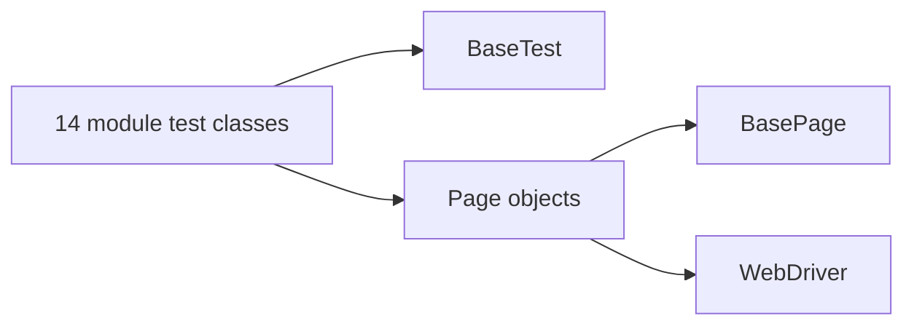

# orangeHRM-selenium

E2E tests for the [OrangeHRM demo site](https://opensource-demo.orangehrmlive.com/web/index.php/auth/login) using **Java Page Object Model (POM)** with Selenium WebDriver, TestNG, and Maven.

## Demo credentials

| Field    | Value     |
|----------|-----------|
| URL      | https://opensource-demo.orangehrmlive.com/web/index.php/auth/login |
| Username | Admin     |
| Password | admin123  |

Configure in [`src/test/resources/config.properties`](src/test/resources/config.properties) (`admin.username`, `admin.password`).

## Run tests

```bash
# Full suite — 72 tests across 14 module classes (~2–3 hours)
mvn clean test

# Visible browser (default is headless)
mvn clean test -Dheadless=false

# Single module
mvn test -Dtest=AuthTest
mvn test -Dtest=AdminTest
mvn test -Dtest=PimTest
```

### GitHub Actions

[`.github/workflows/ci.yml`](.github/workflows/ci.yml) runs the full suite on push/PR to `main` (3-hour timeout):

```bash
mvn clean test -B
```

CI verifies **72** `@Test` methods, publishes a Cypress-style summary, and uploads Surefire reports.

## Architecture



| Layer | Location | Role |
|-------|----------|------|
| Tests | [`src/test/java/com/orangehrm/tests/`](src/test/java/com/orangehrm/tests/) | 14 TestNG classes, 72 `@Test` methods |
| Base | [`BaseTest`](src/test/java/com/orangehrm/base/BaseTest.java) | WebDriver lifecycle, `loginAsAdmin()` |
| Pages | [`src/main/java/com/orangehrm/pages/`](src/main/java/com/orangehrm/pages/) | Locators + intent methods per module |
| Suite | [`testng.xml`](testng.xml) | All 14 module test classes |

### Module test classes (72 tests)

| Class | Tests | Module |
|-------|-------|--------|
| `AuthTest` | 6 | Login, validation, UI smoke |
| `CommonTest` | 3 | Sidebar, user menu, logout |
| `DashboardTest` | 5 | Widgets, quick launch |
| `AdminTest` | 12 | System users, job/org/qualifications topbar |
| `PimTest` | 6 | Employee list, search, add form |
| `LeaveTest` | 8 | Apply leave, entitlements, config |
| `TimeTest` | 8 | Timesheets, attendance, projects |
| `RecruitmentTest` | 6 | Candidates, vacancies |
| `PerformanceTest` | 5 | Reviews, trackers, KPIs |
| `MyInfoTest` | 4 | Personal/contact/emergency tabs |
| `BuzzTest` | 3 | Feed, composer |
| `DirectoryTest` | 2 | Grid, search |
| `ClaimTest` | 1 | Claim module |
| `MaintenanceTest` | 3 | Purge, access module |

Shared navigation and assertions live in [`CommonPage`](src/main/java/com/orangehrm/pages/CommonPage.java).

## Project structure

```
src/main/java/com/orangehrm/
  base/BasePage.java
  pages/LoginPage.java, CommonPage.java, AdminPage.java, ...
src/test/java/com/orangehrm/
  base/BaseTest.java
  tests/AuthTest.java, AdminTest.java, ...   # 14 classes
docs/e2e-spec.csv                            # Archived migration spec (742 steps)
testng.xml
.github/workflows/ci.yml
```

## Adding or changing tests

1. Add locators and intent methods to the relevant page class under `src/main/java/com/orangehrm/pages/`.
2. Add a `@Test` method to the matching module test class under `src/test/java/com/orangehrm/tests/`.
3. Register new test classes in [`testng.xml`](testng.xml) if you add a module.

To regenerate test stubs from the archived CSV spec (optional):

```bash
python3 .github/scripts/generate_pom_tests.py
```

## Known demo-site quirks

- Leave date fields use OrangeHRM `yyyy-dd-mm` format (e.g. `2026-01-07` = 1 July 2026).
- Admin/Time sub-pages require topbar parent click before menu item click.
- `TC_LEAVE_002` (apply personal leave) may fail when demo leave balance is zero.

## Limitations

- Full suite (~72 tests) takes ~2–3 hours in CI.
- Shared demo site may rate-limit; CRUD leave tests add records.
